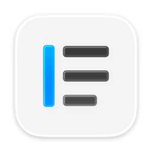
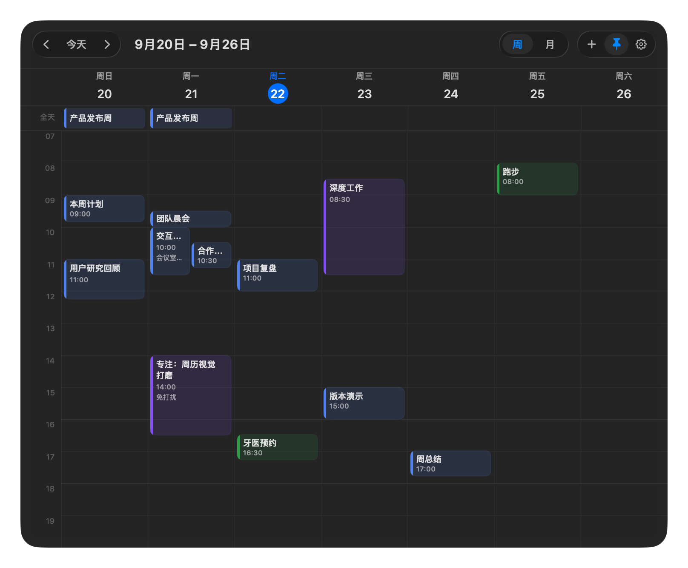
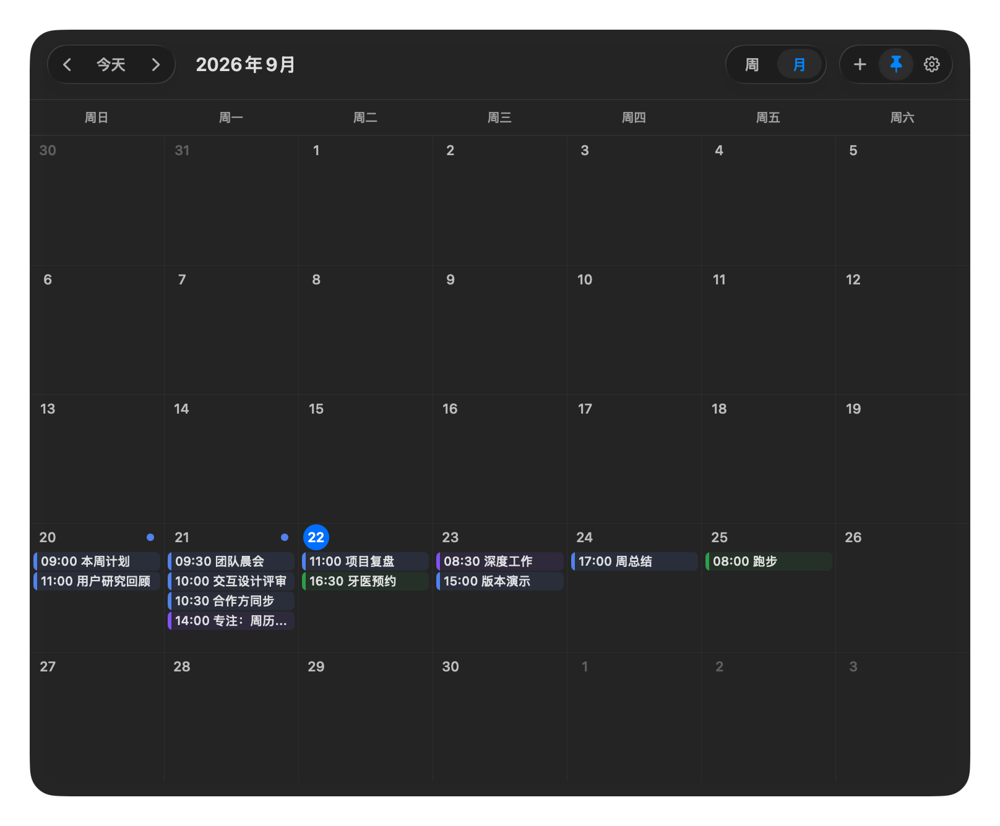
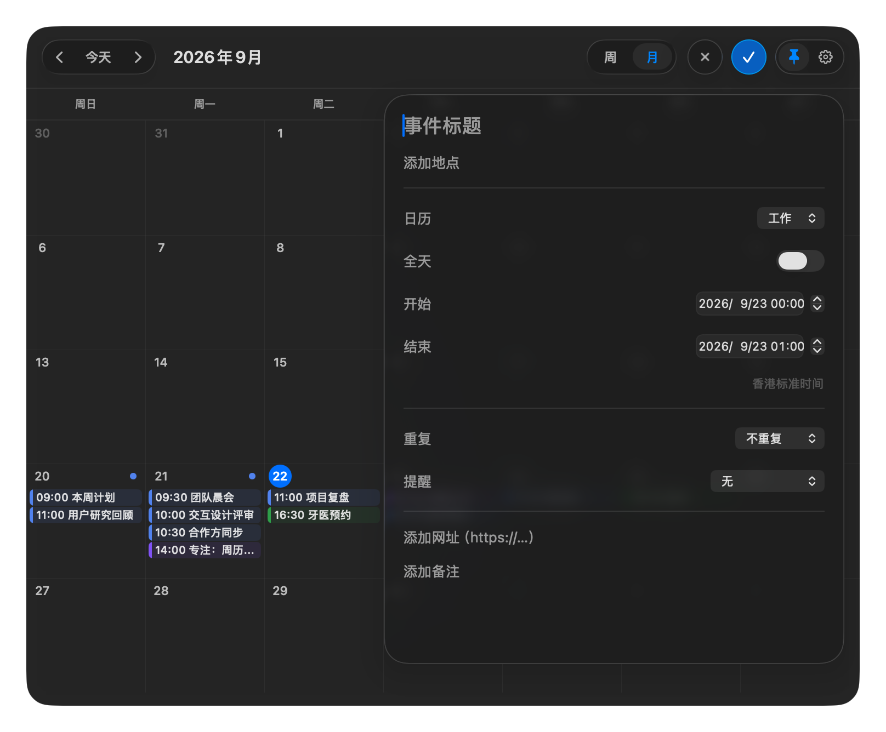

<p align="center">
  
</p>

<h1 align="center">Timepane</h1>

<p align="center">
  A native macOS calendar that stays out of sight until you reach the top-right corner.<br>
  平时完全隐藏，到达屏幕右上角时才出现的 macOS 日历。
</p>

<p align="center">
  <a href="#english">English</a> · <a href="#中文">中文</a>
</p>

<p align="center">
  
  
  <a href="LICENSE"></a>
</p>



## English

Timepane is a compact week and month calendar for macOS. It has no permanent Dock
icon or menu-bar item: push the pointer into the physical top-right corner, click,
and the calendar expands from that corner. Move away to dismiss it, or pin it when
you want the calendar to stay visible.

### Highlights

- **Zero-clutter access** — the screen corner is the target, so there is nothing small
  to aim for and no permanent interface to manage.
- **Week and month views** — switch instantly, navigate with buttons or a horizontal
  trackpad gesture, and jump from a date in the month grid to its week.
- **Readable schedules** — all-day, multi-day, overlapping, and timed events are laid
  out automatically.
- **Event details and links** — inspect time, location, notes, and meeting URLs without
  leaving the calendar.
- **Event creation** — add timed or all-day events with calendar selection, recurrence,
  reminders, location, URL, and notes. Existing events are never edited or deleted.
- **Native behavior** — SwiftUI, AppKit, EventKit, native glass material, Reduced Motion,
  multi-display corner detection, and a pinnable floating panel.
- **Local calendar access** — calendar data is read and written through Apple EventKit.
  Timepane has no account system or calendar server.

### Gallery

| Month overview | Event editor |
| --- | --- |
|  |  |

### Build and run

Requirements:

- macOS 14 or later
- A current Xcode release
- [XcodeGen](https://github.com/yonaskolb/XcodeGen)

```sh
git clone https://github.com/wangjiaxun2005/Timepane.git
cd Timepane
xcodegen generate
open DynamicCalendar.xcodeproj
```

Select the `DynamicCalendar` scheme and your Mac, choose your own development team
if Xcode asks, then run. On first launch, Timepane explains why it needs Calendar
access before showing the macOS permission prompt.

For local development, `Scripts/launch-latest.sh` launches the canonical debug app,
stops stale in-memory copies, and verifies that exactly one expected executable is
running.

### Tests

```sh
xcodebuild \
  -project DynamicCalendar.xcodeproj \
  -scheme DynamicCalendar \
  -destination 'platform=macOS,arch=arm64' \
  test
```

The repository currently contains 166 unit tests covering calendar math, week and
month navigation, gesture gating, event layout, event creation, and panel motion.

### Project layout

- `Sources/DynamicCalendar` — application, models, services, SwiftUI views, and AppKit
  window coordination
- `Tests/DynamicCalendarTests` — unit and motion-invariant tests
- `Design` — app-icon sources and public product screenshots
- `Documentation` — current implementation notes for motion and event creation
- `project.yml` — XcodeGen project definition

Contributions are welcome. Please read [CONTRIBUTING.md](CONTRIBUTING.md) before
opening a pull request.

## 中文

Timepane 是一个轻量的 macOS 周历与月历。它不常驻 Dock，也不占用菜单栏：
把鼠标推到屏幕的物理右上角，单击后日历就从角落展开。鼠标移出后它会自动
收起；需要持续查看时，可以将面板钉住。

### 主要功能

- **零占用唤醒**：屏幕边缘会物理拦住鼠标，无需瞄准小按钮。
- **周视图与月视图**：支持按钮和触控板横向手势翻页，可从月历日期直接进入对应周。
- **自动日程布局**：正确展示全天、跨日、重叠与定时事件。
- **事件详情**：直接查看时间、地点、备注和会议链接。
- **新建事件**：支持定时或全天事件、目标日历、重复规则、提醒、地点、网址与备注；
  不会修改或删除已有事件。
- **macOS 原生体验**：基于 SwiftUI、AppKit 和 EventKit，支持原生玻璃材质、减少动态
  效果、多显示器热角与置顶面板。
- **本地日历数据**：通过 Apple EventKit 读写，不需要 Timepane 账号，也不依赖自建日历服务器。

### 构建与运行

需要 macOS 14 或更高版本、Xcode 与 [XcodeGen](https://github.com/yonaskolb/XcodeGen)。

```sh
git clone https://github.com/wangjiaxun2005/Timepane.git
cd Timepane
xcodegen generate
open DynamicCalendar.xcodeproj
```

在 Xcode 中选择 `DynamicCalendar` scheme 和本机目标。如果 Xcode 提示签名，请选择自己的
Development Team。首次启动时，应用会在系统权限弹窗之前说明为什么需要日历权限。

贡献代码前请阅读 [CONTRIBUTING.md](CONTRIBUTING.md)。

## License

Timepane is available under the [MIT License](LICENSE).
